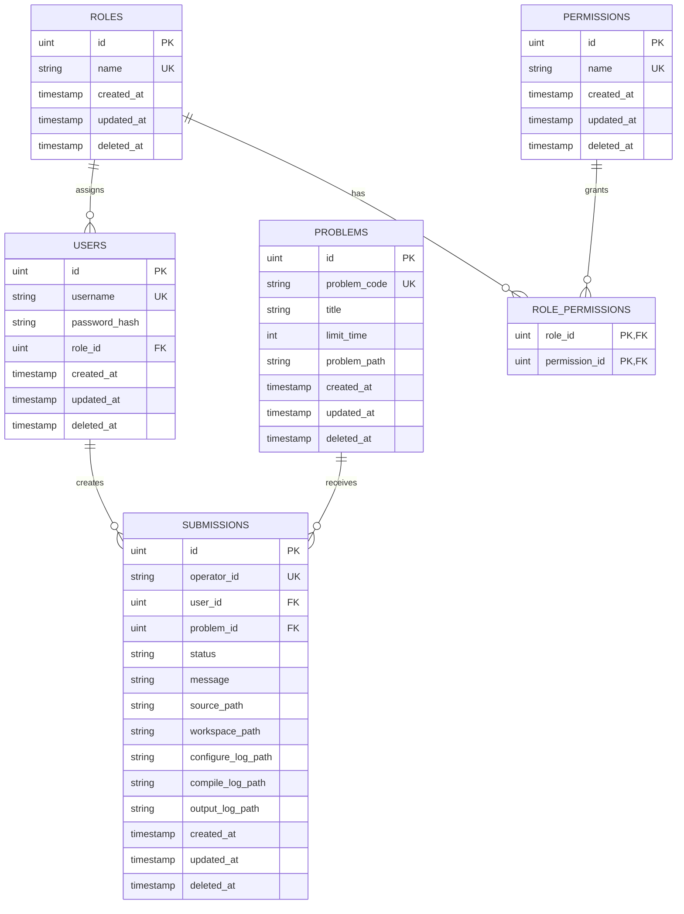

# REGS Online Judge ERD

## 關聯圖

## 關聯說明

- 一個 `Role` 可以分配給多個 `User`，每個 `User` 目前只屬於一個 `Role`。
- `Role` 與 `Permission` 是多對多關係，由 `role_permissions` 關聯表保存。
- 一個 `User` 可以建立多筆 `Submission`。
- 一個 `Problem` 可以收到多筆 `Submission`。
- `Submission.OperatorID` 是對外查詢評測任務使用的 UUID；資料庫主鍵仍為自動遞增的 `ID`。
- GORM 的 `gorm.Model` 會加入 `ID`、`CreatedAt`、`UpdatedAt`、`DeletedAt` 欄位。

## 重要限制

- `users.username` 必須唯一且不可為空。
- `roles.name` 必須唯一且不可為空。
- `permissions.name` 必須唯一且不可為空。
- `problems.problem_code` 必須唯一且不可為空。
- `submissions.operator_id` 必須唯一且不可為空。
- `submissions.user_id` 與 `submissions.problem_id` 不可為空。

## Submission 狀態

- 處理中：`Pending`、`Configuring`、`Compiling`、`Judging`
- 終止狀態：`AC`、`WA`、`CE`、`RE`、`TLE`、`SE`
